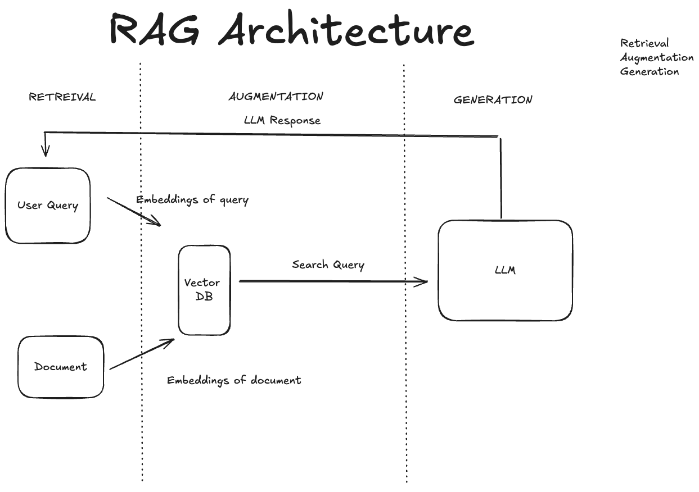

# RAG System

This project implements a Retrieval-Augmented Generation (RAG) system from scratch. RAG combines the power of retrieval-based and generation-based approaches to create more accurate and contextually relevant responses.

## Project Structure

```
rag-system/
├── src/
│   ├── retrieval/
│   │   └── retriever.py
│   ├── generation/
│   │   └── generator.py
│   ├── rag/
│   │   └── rag_system.py
│   ├── main.py
│   └── data_loader.py
├── tests/
│   └── test_rag_system.py
├── data/
│   └── documents.json
├── requirements.txt
├── README.md
└── .gitignore
```

## Project Architecture



## Features

- Retrieval component for finding relevant information
- Generation component for creating responses
- Integration of retrieval and generation for enhanced output
- Simple API/interface for interacting with the RAG system

## Setup

1. Clone the repository:
   ```
   git clone https://github.com/bharadwaj-pendyala/building-rag.git
   cd rag-system
   ```

2. Create a virtual environment:
   ```
   python -m venv venv
   source venv/bin/activate  # On Windows, use `venv\Scripts\activate`
   ```

3. Install dependencies:
   ```
   pip install -r requirements.txt
   ```

## Usage

1. Prepare your documents:
   Create a JSON file in the `data` directory (e.g., `data/documents.json`) with your documents in the following format:
   ```json
   [
     {"id": "1", "content": "Document content here"},
     {"id": "2", "content": "Another document content here"},
     ...
   ]
   ```

2. Update the `src/main.py` file to load your documents:
   ```python
   from src.data_loader import load_documents

   documents = load_documents('data/documents.json')
   rag_system = RAGSystem(documents)
   ```

3. Start the API:
   ```
   uvicorn src.main:app --reload
   ```

4. Send a POST request to `http://localhost:8000/query` with a JSON body:
   ```json
   {
     "text": "Your query here"
   }
   ```

## Running Tests

Run the tests using pytest:
```
pytest tests/
```

## Contributing

Contributions are welcome! Please feel free to submit a Pull Request.

## License

This project is licensed under the MIT License - see the [LICENSE](LICENSE) file for details.