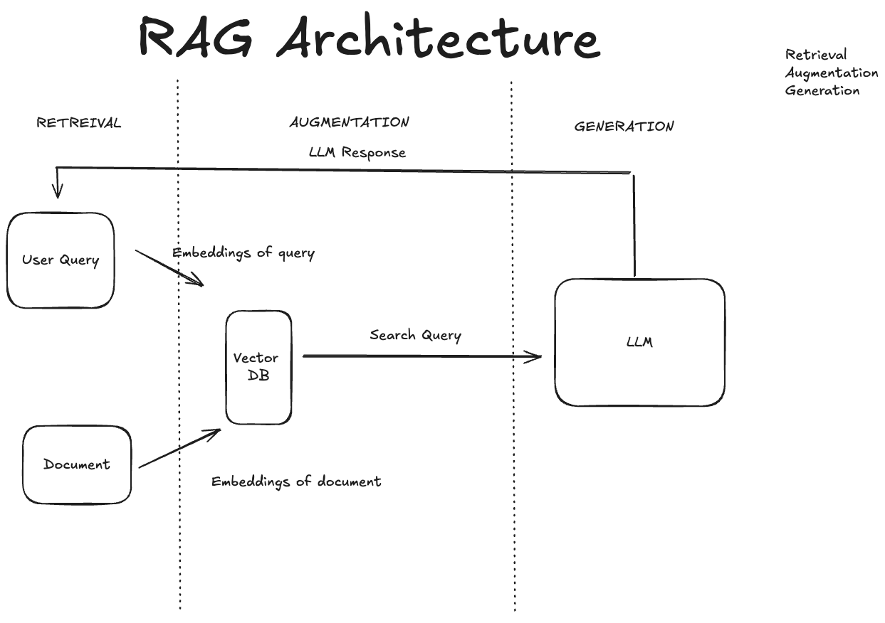

# RAG System Primer

This repository is a beginner-friendly Retrieval-Augmented Generation (RAG) project using LangChain + OpenAI. It loads several document types, chunks them, embeds them, stores them in Chroma, and answers questions in an interactive CLI.

## What you will learn

- How to load heterogeneous data sources into a shared `Document` format.
- How chunking affects retrieval behavior.
- How embeddings + vector stores power semantic search.
- How retrieval context is injected into an LLM prompt.

## Architecture



> The diagram is conceptual and may not map 1:1 to every implementation detail.

## Features

- Text, PDF, JSON, CSV, and YouTube transcript loaders
- Configurable text splitting
- OpenAI embeddings
- Chroma vector store
- RetrievalQA chain with a custom prompt
- Interactive command-line Q&A loop

## Repository structure

```text
.
├── README.md
├── requirements.txt
├── docs/
│   └── diagrams/
│       └── RAG_Arch.png
└── rag/
    ├── main.py                 # CLI entrypoint + chain wiring
    ├── config/
    │   └── settings.py         # Env loading + API key validation
    ├── loaders/
    │   ├── text_loader.py
    │   ├── pdf_loader.py
    │   ├── json_loader.py
    │   ├── csv_loader.py
    │   └── youtube_loader.py
    ├── utils/
    │   └── splitter.py
    └── data/                   # Sample learning data used by default
```

## Setup

1. Clone the repository.
2. Create and activate a virtual environment.
3. Install dependencies.
4. Add your OpenAI API key to `.env`.

```bash
git clone <your-repo-url>
cd building-rag
python -m venv .venv
source .venv/bin/activate
pip install -r requirements.txt
```

Create `.env` in the project root:

```bash
OPENAI_API_KEY=your_api_key_here
```

## Run

From the repository root:

```bash
python rag/main.py
```

Then ask questions in the CLI. Type `exit` to quit.

## How it works

1. `rag/main.py` loads sample documents from `rag/data/` plus a YouTube transcript.
2. All documents are chunked with `rag/utils/splitter.py`.
3. Chunks are embedded with OpenAI embeddings.
4. Chunks are indexed in Chroma.
5. A `RetrievalQA` chain fetches relevant chunks and sends them to the LLM with a prompt template.
6. The CLI loop accepts user questions and prints answers.

## Customization ideas for learning

- Change `chunk_size` and `chunk_overlap` in `split_text()`.
- Swap the model in `ChatOpenAI(model_name=...)`.
- Replace sample files in `rag/data/` with your own domain data.
- Tweak the prompt template to study response grounding behavior.
- Add metadata-based filtering in retrieval.

## Troubleshooting

- **`API key not found`**: ensure `.env` exists in the repository root and contains `OPENAI_API_KEY`.
- **YouTube transcript unavailable**: some videos disable transcripts; choose a different URL.
- **Import/path errors**: run from repository root with `python rag/main.py`.

## License

This project is licensed under the MIT License. See [LICENSE](LICENSE).
